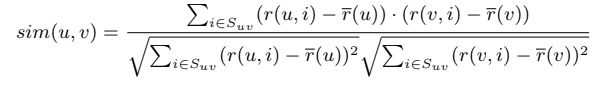
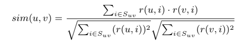
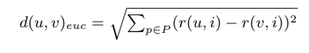
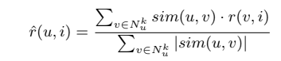
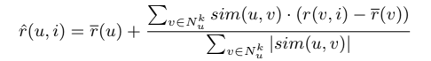
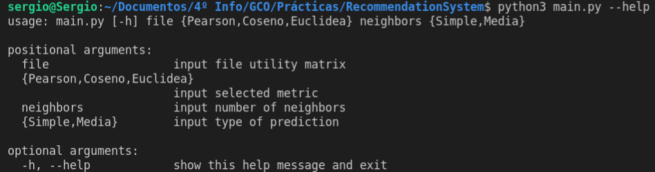
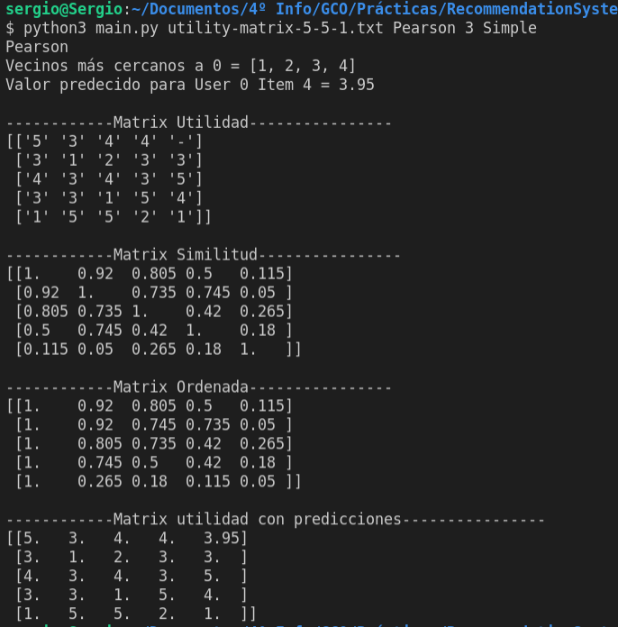
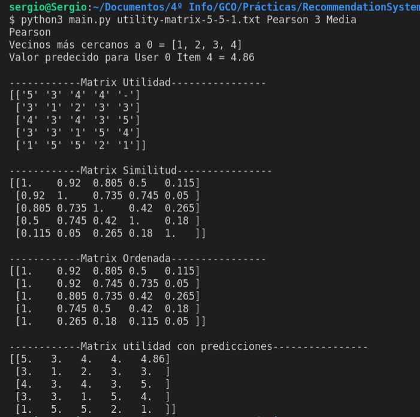

# Sistema de recomendación
## Descripción del código 
Esta práctica cuyo objetivo es implementar un sistema de recomendación siguiendo el método de filtrado colaborativo. Para dicha implementación se ha elegido **Python** como lenguaje de programación. Dicho programa ha sido dividido en dos ficheros [main.py](./main.py) y el [recommendationSystem.py](recommendationSystem.py). 

### main.py
En esta fichero esta ubicado el código fuente, en el cual se ubica el código necesario para la introducción de parámetros por línea de comandos. Para ello se hace uso del módulo **argparse** el cual nos permite establecer unos parámetros obligatorios para nuestro programa así como los posibles valores que puede tomar dichos parámetros.  
```python
  parser = argparse.ArgumentParser()
  parser.add_argument("file", type=str, help="input file utility matrix")
  parser.add_argument("metrics", type=str, choices=["Pearson", "Coseno", "Euclidea"], help="input selected metric")
  parser.add_argument("neighbors", type=int, default=3, help="input number of neighbors")
  parser.add_argument("prediction", type=str, choices=["Simple", "Media"], help="input type of prediction")
  args = parser.parse_args()
```

Además aquí también se instancia un objeto de la clase **RecommendationSystem** para poder acceder y realizar las diversas operaciones para poder realizar el cálculo para la predicción de la matriz utilidad en base a los vecinos seleccionados.

### recommendationSystem.py
En este fichero se codifica la clase **RecommendationSystem**, la cual tiene una serie de métodos y atributos necesarios para cumplir con el objetivo de la práctica.

#### Atributos
* ```self.matrix```: Matriz utilidad leida directamente del fichero de texto indicado por línea de comandos.
* ```self.utilityMatrix```: Matriz utilidad en formato numérico para poder trabajar de una manera más cómoda y donde los '-' han sido sustituidos por *-1*
* ```self.sim```: Matriz de similitud entre usuarios
* ```self.simOrderByProximity```: Matriz de similud ordenados según su cercanía
* ```self.numOfNeighbors```: Número de vecinos introducidos por línea comandos
* ```self.predictionMatrix```: Matriz resultado, donde los valores desconocidos han sido predecidos y sustituidos por el correspondiente valor.  

#### Métodos
##### Métricas
* **pearson**  
Método encargado de calcular la correlación de pearson entre dos usuarios y rellenar de con estos valores la matriz de similitud (```self.sim```). 
Para ello aplicamos la siguiente fórmula:  

El código para realizar dicho cálculo para cada par de usuarios es el siguiente: 
  ```python
    for i in range(numOfItems):
      if (itemsCalificados[i] == 1): # Solo los que hayan sido calificados por ambos
        x = self.utilityMatrix[u][i] - meanUserU
        y = self.utilityMatrix[v][i] - meanUserV
        sumOfDividend += x * y
        sumOfx += x ** 2
        sumOfy += y ** 2
        
    x2 = math.sqrt(sumOfx)
    y2 = math.sqrt(sumOfy)
    divisor = x2 * y2
          
    sim = round((sumOfDividend / divisor),2)
    # Normalizar los valores de similitud entre [0,1]
    sim = (sim-(-1)) / (1-(-1))
    self.sim[u][v] = sim
  ```  
* **cosineDistance**  
Método encargado de calcular la distancia coseno entre dos usuarios y rellenar de con estos valores la matriz de similitud (```self.sim```) de una manera diferente a la correlación de Pearson. 
Para ello aplicamos la siguiente fórmula: 

El código para realizar dicho cálculo para cada par de usuarios es el siguiente: 
  ```python
    for i in range(numOfItems):
      if (itemsCalificados[i] == 1): # Solo los que hayan sido calificados por ambos
        x = self.utilityMatrix[u][i]
        y = self.utilityMatrix[v][i]
        sumOfDividend += x * y
        sumOfx += x ** 2
        sumOfy += y ** 2
        
    x2 = math.sqrt(sumOfx)
    y2 = math.sqrt(sumOfy)
    divisor = x2 * y2
          
    self.sim[u][v] = round((sumOfDividend / divisor),2)
  ```  
* **euclideanDistance**  
Método encargado de calcular la distancia euclidea entre dos usuarios y rellenar de con estos valores la matriz de similitud (```self.sim```) de una manera diferente a la correlación de Pearson y la distacia coseno. 
Para ello aplicamos la siguiente fórmula:   
  
El código para realizar dicho cálculo para cada par de usuarios es el siguiente: 
  ```python
    for i in range(numOfItems):
      if (itemsCalificados[i] == 1): # Solo los que hayan sido calificados por ambos
        x = self.utilityMatrix[u][i]
        y = self.utilityMatrix[v][i]
        sum += (x - y) ** 2
        
    dEuc = math.sqrt(sum)
    self.sim[u][v] = round(dEuc,2)
  ```
##### Tipo de predicción
* **simple**  
Este método es el encargado de calcular el valor desconocido **r(u, i)** utilizando las puntuaciones asignadas a los ítems **i** de los usuarios **v** más próximos. 
La fórmula para dicha predicción es la siguiente:   
  
El código para la aplicación de dicha fórmula es el siguiente:
  ```python
    # Recorrer matriz utilidad 
    for u in range(len(self.utilityMatrix)):
      for i in range(len(self.utilityMatrix[u])):
        if (self.utilityMatrix[u][i] != -1):
          # Rellenamos la matriz predicción primero con los valores conocidos de la matriz utilidad 
          self.predictionMatrix[u][i] = self.utilityMatrix[u][i]
        else:
          # Encontrar los k vecinos más proximos a u
          k = self.nearNeighbors(u)
          dividend, divisor = 0, 0
          count = 0
          for v in k:
            # Comprobar que solo se realizan los vecinos necesarios introducidos por linea comandos
            if (count < self.numOfNeighbors):
              sim = self.sim[u][v]
              r = self.utilityMatrix[v][i]
              # Si la calificación es desconocida entonces es -1 y no la cogemos sino pasamos al siguiente vecino
              if (r == -1):
                count += -1
              else: 
                dividend += sim * r
                divisor += abs(sim)
                count += 1

          x = round(dividend/divisor, 2)
          self.predictionMatrix[u][i] = x
          print("Valor predecido para User " + str(u) + " Item " + str(i) + " = " + str(x))
  ```  
* **mean**  
Este método es el encargado de calcular el valor desconocido **r(u, i)** considerando en este caso la diferencia con la media, pues la predicción simple no tiene en cuenta estas predicciones. 
La fórmula para dicha predicción es la siguiente:   
  
El código para la aplicación de dicha fórmula es el siguiente:
  ```python
    # Recorrer matriz identidad
    for u in range(len(self.utilityMatrix)):
        for i in range(len(self.utilityMatrix[u])):
          if (self.utilityMatrix[u][i] != -1):
            # Rellenamos la matriz predicción primero con los valores conocidos de la matriz utilidad 
            self.predictionMatrix[u][i] = self.utilityMatrix[u][i]
          else:
            # Encontrar los k vecinos más proximos a u
            k = self.nearNeighbors(u)
            dividend, divisor = 0, 0
            meanUserU = self.mean(u) # Calculamos la media de U
            count = 0
            for v in k:
              # Comprobar que solo se realizan los vecinos necesarios
              if (count < self.numOfNeighbors):
                sim = self.sim[u][v]
                r = self.utilityMatrix[v][i]
                if (r == -1):
                  count += -1
                else:
                  meanUserV = self.mean(v) # Calculamos la media de V

                  dividend += sim * (r - meanUserV)
                  divisor += abs(sim)
                  count += 1
            
            x = round(meanUserU + (dividend/divisor),2)
            self.predictionMatrix[u][i] = x
            print("Valor predecido para User " + str(u) + " Item " + str(i) + " = " + str(x))
  ```  

## Ejemplo de uso 
Para hacer uso de este sistema recomendador debemos de poder acceder a una terminal y desde esta acceder al directorio donde esta ubicado este código. Una vez en el directorio haciendo uso de ```python3``` disponemos de varias formas de ejcución del programa dependiendo de los parámetros pasados. 
Los parámetros son los siguientes y deben ser pasados en este mismo orden:  
```bash
  $ python3 main.py [nombre_fichero_matriz_utilidad] [Métrica] [Nº vecinos] [Predicción]
```
En cuanto a las salida obtenida por las distintas ejecuciones, se pueden distinguir las siguientes partes: 
* Calculos de cada predicción
* Matriz utilidad
* Matriz similitud
* Matriz ordenada
* Matriz utilidad con predicciones

### Opción: --help 
  

### Opción: Pearson, 3, Simple
  

### Opción: Pearson, 3, Media
  


